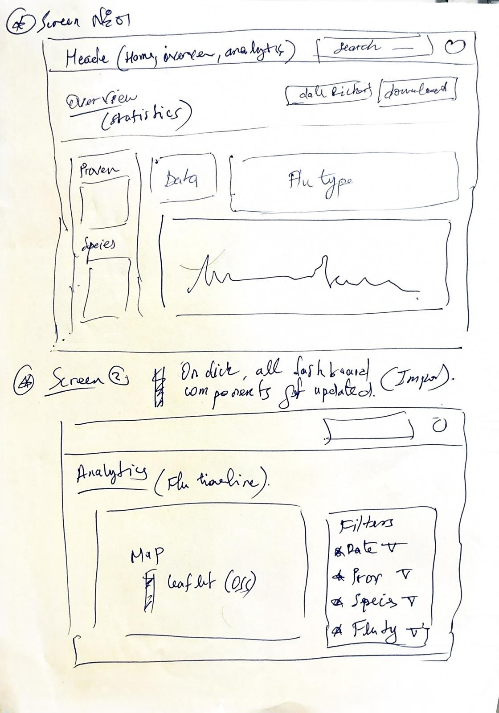

# **Bird flu control system**

This is the main monorepo codebase:  Link to Webiste :  [SDSC-BF-CS](https://sdsc-bird-flu-cs.vercel.app/).

## What is Bird flu CS?


This control dashboard integrates diverse open data into a user-friendly interface, allowing stakeholders to easily visualize and analyze bird flu. Designed with FAIR and ORD principles, it ensures that complex geospatial data and domain data is accessible and actionable for informed decision-making.

This is the first wareframe for the app

### Codebase

#### **Technical Overview**

The app is structured as a  **monorepo** , leveraging some pre-defined packages for linting and TypeScript configuration, managed through  **Turborepo** . These configurations were adjusted as necessary to meet the project’s needs.

The provided data was integrated into a **SQLite3 database** hosted on  **Turso** , allowing for efficient querying and interaction with the dataset.

Since the app is built with  **Next.js** , I opted not to implement a separate backend service. **Server components** and **API routes** (with one endpoint use case) were sufficient for this application. However, as the app scales for maintainability and extensibility, a dedicated **REST** or **GraphQL service** could be introduced.

I use **Bunjs** as package manager and Nextjs to power the frontend and backend (which just one entrypoint) apps. All of the code you'll touch in this codebase will be Typescript/JavaScript.

#### Technologies

Here is a list of all the big technologies I use:

- **Sqlite**: Data storage (deployed in **Turso).**
- ****DrizzleOrm**: ORM for data access.**
- ****Typescript**: Type-safe JavaScript.**
- ****Nextjs**: Fullstack react app.**
- ****Tailwindcss**: HTML styling.**

#### Folder structure

The app is using monorepo architecture managed by [Turborepo](https://turbo.build/repo/docs) with following structure

```sh
www/
├── apps
    ├── web       # web application powered by react
        ├── app   # all page using file-system routing system
	   ├── api   # one entrypoint to get the flu spreading timeline
├── packages
    ├── ui        # package for gathering all atoms components
	├── NOTE: the components are a mix between shadcn and custom components
    ├── repository    # Data access layer (all db queries are assembled here)
```

### First time setup

The first step to running vision-app (my first name to the app :)) locally is downloading the code by cloning the repository:

```sh
git clone https://github.com/bilalesi/sdsc-bird-flu-repo
```

#### Installation

1. **Get DB credentials**: Send by email, please put them in `.env` file in the `apps/web` application
2. **Install bun**: I use [bun](https://bun.sh/) to handle our JavaScript dependencies, and monoropo
3. **Install dependencies:** run the command in the top level folder of the app

```sh
bun install
```

You've now finished installing everything!

#### Getting the secrets

Please reach out to me by email if I forget to send them already.

Now you're ready to run the app locally and sign into your local instance!

### Running the app locally

#### Start the app

The app do not need any magic to start just use this command in the top level folder of the app as always

```
bun run dev
```

### How I build the application

The application was designed with politicians in mind, prioritizing a clean and simple interface that highlights the most relevant information for decision-making. To achieve this:

1. **Overview Page** : This page displays key statistics at a glance, providing users with an immediate understanding of the situation over a specific time period. Additionally, an interactive graph is included, allowing users to filter data by:
   * Flu type.
   * Provenance.
   * Bird species.
2. **Analytics Page** : This page visualizes the virus spread on a map, helping politicians make informed decisions based on geographic data. It highlights how quickly the virus is spreading and identifies periods of increase or decline.
3. **Reports Page**: Intended for PDF report, downloading specific data - future work :)
4. The app also provide a nice entry point from the home page to login page (without real authentication). **#JUST HIT (SIGN IN WITH EMAIL) to ACCESS THE  APP**
5. The app also has other functionlities as (searchbar, account menu), but not yet implemented due time restriction.
6. The analytics page miss some responsivness and some nice touch when change filters, need some imporvements in futur work to add graph and timeline as the heatmap change.

### **Test Experience**

Building the dashboard was an intersting challenge, with a focus on meeting specific client requirements. The test took approximately 8 to 9.5 hours to complete, excluding documentation and deployment time (Plus for quick access to result).
